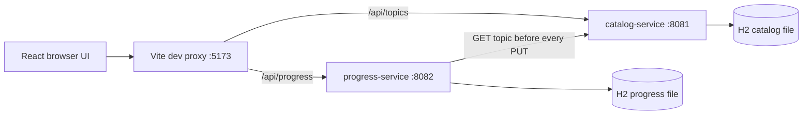

# Track 04 — Spring, persistence, and microservices

Build a real but deliberately small distributed study planner, then explain why it
behaves as it does. Two independently runnable Spring Boot **3.5.6** applications
use **JDK 17**, Maven **3.9+**, HTTP, JPA, and separate embedded H2 databases.
The React client in [track 06](../06-frontend-react-ui/README.md) displays topics
from all six course tracks and persists one learner's study progress.

## Learning route

Prerequisites: Java classes/interfaces, exceptions, collections, HTTP/JSON, and
basic SQL. If those are unfamiliar, begin with [Java](../01-core-java/README.md)
and [SQL](../SQL_AND_DATA_MODELING.md).

| Stage | Time | Read / do | Evidence you should produce |
|---|---:|---|---|
| 1 | 60 min | Start the system; inspect [API contracts](API.md) | Successful GET, PUT, reload |
| 2 | 90 min | [Course](COURSE.md), lessons 1–3 | Trace DI, validation, transaction boundary |
| 3 | 90 min | Course, lessons 4–6 | Explain generated SQL, idempotency, isolation |
| 4 | 90 min | Course, lessons 7–9 | Failure drill and test coverage map |
| 5 | 120 min | Course, lessons 10–13 | Proposed resilient architecture with trade-offs |
| 6 | 120 min | [Exercises + worked solutions](EXERCISES.md) | Tests first; implementation; explanation |
| 7 | 60 min | [Interview answers](INTERVIEW.md) | Answer aloud before reading each solution |

Repeat a lesson until you can **predict → run → explain → change → test** it.
Do not count reading as mastery. The twelve seeded topics are study-planning
entries, not substitutes for the six folders' full curricula.

## What actually runs



No diagram renderer? Browser → Vite → either service; progress-service also
calls catalog-service to validate a topic before it writes its own database.
There is **no shared database, broker, gateway product, registry, login,
container deployment, circuit breaker, outbox, or saga**. These are taught as
explicit design extensions in the course, not advertised as implemented.

### Safety and persistence boundaries

- This is an **unauthenticated local learning demo**, not a secure deployment.
  Java and Vite bind to `127.0.0.1`. Do not override that for a public network.
- There is one shared learner: every API caller reads/writes the same progress.
  No credentials or personal information belong in notes.
- H2 files are created under `./data` relative to **each service's working
  directory**. Always start from the module directories shown below.
- `local` is the default profile; it uses Hibernate `ddl-auto=update` for learning.
  Production needs reviewed schema migrations, secrets, TLS, auth, backups,
  operational ownership, and a real deployment review.
- Tests activate `test` and use in-memory H2; they do not erase your local files.
- Startup seeds only missing catalog IDs; it does not overwrite saved topics.
  Changing seed text does not update existing rows. For a clean catalog, stop
  catalog-service and remove only its `data/` folder after deciding its data is disposable.

## Run end to end

Open a shell in this `04-backend-spring-microservices` directory.

```bash
# macOS example. On Linux/Windows set JAVA_HOME to an installed JDK 17.
export JAVA_HOME=$(/usr/libexec/java_home -v 17)
export PATH="$JAVA_HOME/bin:$PATH"
java -version
mvn -version
mvn clean verify
```

The enforcer intentionally rejects JDK 18+ so examples and tests use a coherent
toolchain. `mvn -version` must also report Java 17, not merely `java -version`.
If Maven is absent but the original workspace wrappers are present, use the
existing wrapper without copying or changing it:

```bash
# From this backend directory; workspace-specific fallback.
../../eureka/mvnw -f "$PWD/pom.xml" clean verify
```

**Terminal 1**, from this backend directory:

```bash
cd catalog-service
java -jar target/catalog-service-1.0.0-SNAPSHOT.jar
```

**Terminal 2**, independently from this backend directory:

```bash
cd progress-service
# Optional: export CATALOG_BASE_URL=http://127.0.0.1:8081
java -jar target/progress-service-1.0.0-SNAPSHOT.jar
```

**Terminal 3**, from this backend directory:

```bash
cd ../06-frontend-react-ui
npm ci
npm run dev
```

Use Node 22+ (an LTS release is recommended). Open **http://127.0.0.1:5173**.
Select a track, check a topic, add a note, and press **Save progress**. Reload the
page: the saved state is returned by progress-service, not localStorage.
Stop/restart progress-service in the **same directory**, reload again, and
verify the saved record survived. Stop all three processes with Ctrl-C.

Direct checks (no browser required):

```bash
curl -fsS http://127.0.0.1:8081/actuator/health
curl -fsS http://127.0.0.1:8082/actuator/health
curl -fsS 'http://127.0.0.1:8081/api/topics?track=spring'
curl -i -X PUT http://127.0.0.1:8082/api/progress/spring-transactions \
  -H 'Content-Type: application/json' \
  -d '{"completed":true,"note":"Explain proxy boundaries without notes"}'
curl -fsS http://127.0.0.1:8082/api/progress
```

The former single `prep-service` and `/api/health` endpoint were replaced by these
two modules. Use `/actuator/health` on each service.

## Failure lab

1. Start all processes, load the UI, then stop **catalog-service**.
2. Change an existing topic's note and save. Expect HTTP **503**, a visible alert,
   and the original saved total. Your draft stays in the form.
3. Direct `GET :8082/api/progress` still works: reads don't call catalog.
4. Restart catalog and press Save again. Expect 200 and updated persisted state.
5. Stop progress-service and reload: the UI displays a load error with Retry,
   **not an empty list that looks like successful progress retrieval**.
6. PUT a missing catalog ID: expect 404, not a newly invented topic.

A lost response after a write is ambiguous: the write may have committed.
Reload before deciding whether to retry. The explicit-state PUT is idempotent;
it is not an exactly-once delivery guarantee.

## Code-reading map

| Responsibility | Files |
|---|---|
| Bootstrapping and component scan | `CatalogApplication`, `ProgressApplication` |
| HTTP/validation | `TopicController`, `ProgressController`, `ProgressRequest` |
| Catalog queries / DTO conversion | `TopicService`, `Topic`, `TopicResponse` |
| Remote precondition | `CatalogClient`, `HttpClientConfiguration` |
| Orchestration vs local transaction | `ProgressService` → separate `ProgressStore` bean |
| Persistence / concurrency | `StudyProgress` (`@Version`), repositories |
| Error contracts | `ApiErrors` in each service |
| Local DB configuration | each module's `application-local.properties` |
| Tests | each module's `src/test/java` |

Connect timeout is 1 second and socket read timeout is 2 seconds. These bound
specific network phases, **not** a universal end-to-end deadline including DNS,
queueing, or every byte of a streaming response. There are no automatic retries.

## Verify and troubleshoot

```bash
# From this backend directory: all eight current backend test methods.
mvn test
# Narrow an iteration to one module.
mvn -pl progress-service test
# Package runnable jars after edits.
mvn package
```

Catalog integration tests verify the seed, filtering, lookup, validation, and
health. Progress unit tests verify remote-before-local ordering and no writes on
failure. Its integration tests exercise controllers, JPA/H2, validation,
idempotent replacement, and a real local HTTP stub returning 404/500/malformed/
delayed responses. MockMvc does not start the application's TCP server; the
startup/curl drill covers the actual HTTP entry points.

| Symptom | Diagnose / fix |
|---|---|
| Java version rejected | Set `JAVA_HOME` and PATH in this terminal; check Maven's runtime |
| Address already in use | Stop only your process or choose coordinated ports; don't kill unrelated processes |
| UI API 500/502 or network error | Check both Java logs, service health, Vite proxy targets |
| H2 file already in use | Another instance uses that DB; stop it, never delete its live file |
| Saved data “disappeared” | Check working directory/profile before assuming data loss |
| Port changed silently | Vite uses `strictPort`; choose/coordinate an explicit alternative |
| 409 on simultaneous writes | Reload, reconcile desired state, then save; this is not multi-user merge support |

Further study: [Spring reference](https://docs.spring.io/spring-framework/reference/),
[Boot reference](https://docs.spring.io/spring-boot/3.5/),
[Hibernate user guide](https://docs.jboss.org/hibernate/orm/6.6/userguide/html_single/Hibernate_User_Guide.html),
[HTTP semantics](https://www.rfc-editor.org/rfc/rfc9110).
